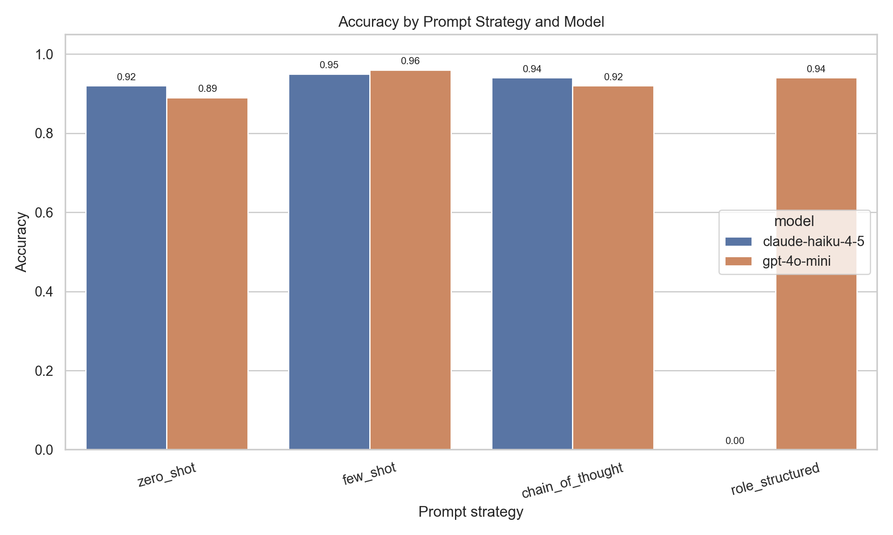
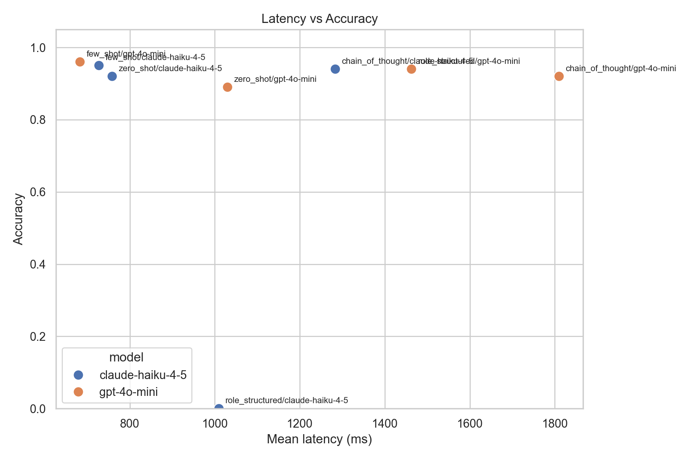
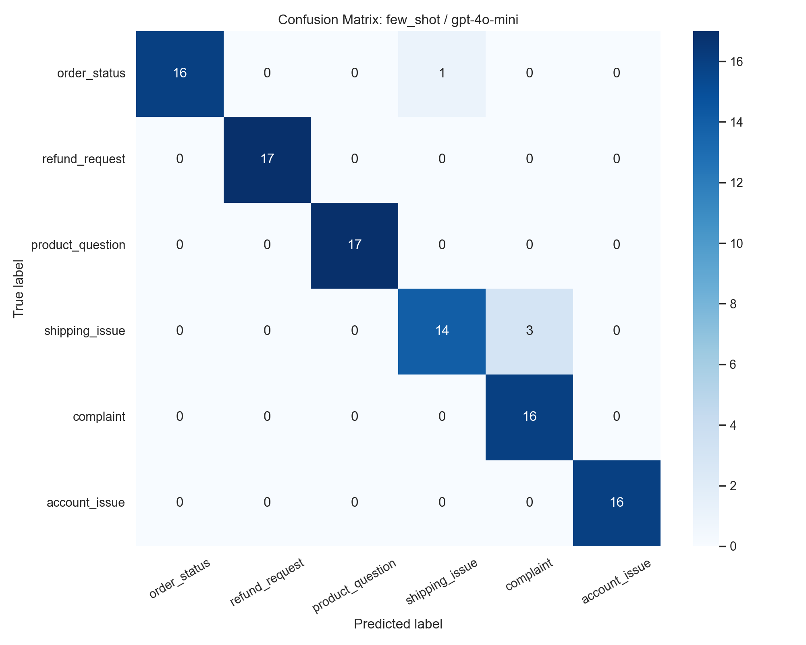
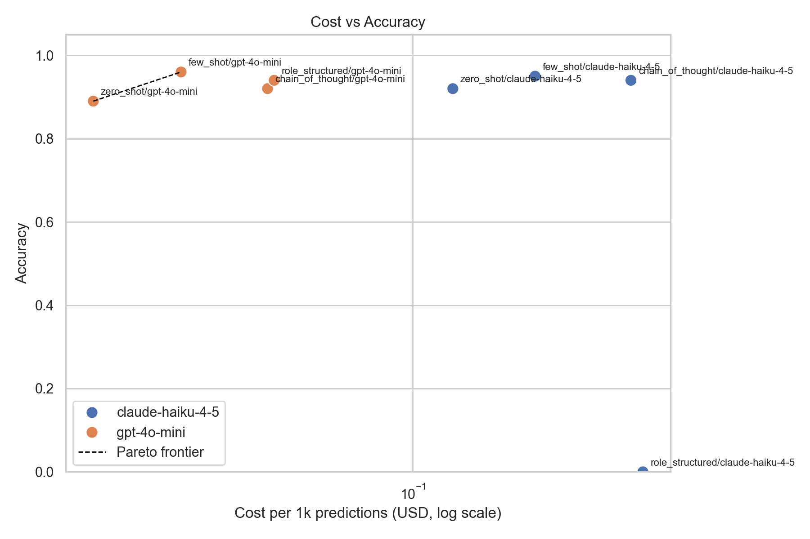

# LLM Prompt Evaluation Framework

> A reproducible prompt evaluation framework that benchmarks zero-shot, few-shot, chain-of-thought, and structured-output prompting across Claude Haiku 4.5 and GPT-4o-mini on an e-commerce customer support classification task.

[](https://www.python.org/)
[](https://platform.openai.com/)
[](https://www.anthropic.com/)
[](https://pandas.pydata.org/)
[](https://scikit-learn.org/)
[](https://matplotlib.org/)
[](#license)

---

## What Is This?

This project is an offline evaluation harness for prompt engineering. It answers a practical production question:

> If I need to classify customer support tickets with an LLM, which prompt strategy gives the best balance of accuracy, latency, cost, parse reliability, and confidence calibration?

The benchmark runs the same 100 labeled e-commerce support messages through 8 experimental conditions:

```text
4 prompt strategies x 2 models x 100 examples = 800 model calls
```

The framework saves raw predictions, computes metrics, and generates comparison plots so prompt changes can be judged with evidence instead of vibes.

| File | Responsibility |
|---|---|
| `run_eval.py` | Single command entry point for the full benchmark |
| `src/llm_clients.py` | Raw OpenAI and Anthropic SDK wrappers with retry, latency, token, and cost tracking |
| `src/classifier.py` | Prompt rendering and response parsing |
| `src/runner.py` | Orchestrates all prompts, models, and dataset rows |
| `src/evaluator.py` | Computes metrics and generates plots |
| `data/test_set.csv` | 100 labeled e-commerce customer support messages |
| `prompts/*.txt` | The four prompt strategies being compared |
| `results/metrics_summary.csv` | Saved aggregate metrics from the evaluation |
| `results/plots/` | Saved visualization artifacts |
| `how_to_make_it_work.md` | Standalone step-by-step run guide, also included below |

---

## Why I Built This Prompt Eval

> I built an evaluation framework comparing zero-shot, few-shot, chain-of-thought, and structured-output prompting across two models on a 100-example customer support classification dataset. I tracked accuracy, latency, cost, and confidence calibration. The most surprising finding was that chain-of-thought actually hurt the cost/quality tradeoff for this task — the latency cost wasn't worth the marginal accuracy gain. For a production system, I'd add online A/B testing on top of this offline framework.

Systematic prompt evaluation matters because production LLM systems rarely optimize for accuracy alone. A prompt that is 1 point more accurate may be much slower, more expensive, harder to parse, or poorly calibrated. This framework makes those tradeoffs visible.

For someone new to prompt evaluation: the idea is simple. You freeze a labeled dataset, run every prompt/model combination against the exact same examples, parse the model outputs the same way every time, and compare the results with clear metrics.

---

## Screenshots

### Run Start - Cost Confirmation


The script estimates the upper-bound API cost before making calls, then asks for confirmation. This protects against accidentally launching an expensive run.

### Evaluation Progress - Early Run


The benchmark uses `tqdm` progress bars and logs successful API responses from both providers.

### Evaluation Progress - Mid Run


Every condition is run over the same dataset. The only variables are prompt strategy and model.

### Evaluation Progress - Later Run


Longer prompts, especially chain-of-thought and structured JSON prompts, generally increase latency and cost because they produce more output tokens.

---

## Results Plots

### Accuracy Comparison



Few-shot prompting with GPT-4o-mini produced the best accuracy in this run: **96%**.

### Latency vs Accuracy



This plot shows the practical tradeoff between model quality and response time. The best production choice is not always the top accuracy point if latency matters.

### Best Confusion Matrix



The confusion matrix is generated for the single best condition by accuracy. In this run, the hardest boundary was around shipping-related issues and broader complaints/order-status messages.

### Cost vs Accuracy



GPT-4o-mini was much cheaper per 1,000 predictions in this run. Chain-of-thought increased cost without improving the cost/quality tradeoff enough to justify it for this task.

---

## Key Findings From This Run

- **Best overall condition:** `few_shot` with `gpt-4o-mini`, with **0.96 accuracy** and **0.960 macro F1**.
- **Best cost/quality tradeoff:** `few_shot` with `gpt-4o-mini`, because it was more accurate and faster than both chain-of-thought runs while remaining very cheap.
- **Cheapest condition:** `zero_shot` with `gpt-4o-mini`, at about **$0.014 per 1,000 predictions**, but accuracy dropped to **0.89**.
- **Chain-of-thought was not worth it here:** it added latency and output-token cost without beating the few-shot baseline.
- **Structured JSON was useful for confidence calibration with GPT-4o-mini:** `role_structured` with GPT-4o-mini had **0.94 accuracy** and **0.040 ECE**.
- **Strict output parsing matters:** Claude's structured-output run returned Markdown-fenced JSON, which the strict JSON parser marked as invalid. That produced a 100% invalid rate for that condition and is a useful reminder that parse reliability is part of prompt quality.

---

## Summary Metrics

These numbers come from `results/metrics_summary.csv`.

| Prompt Strategy | Model | Accuracy | Macro F1 | Mean Latency | P95 Latency | Cost / 1k Predictions | Invalid Rate | ECE |
|---|---:|---:|---:|---:|---:|---:|---:|---:|
| zero_shot | claude-haiku-4-5 | 0.92 | 0.919 | 759 ms | 1339 ms | $0.128 | 0% | - |
| zero_shot | gpt-4o-mini | 0.89 | 0.883 | 1030 ms | 1874 ms | $0.014 | 0% | - |
| few_shot | claude-haiku-4-5 | 0.95 | 0.948 | 728 ms | 1102 ms | $0.212 | 0% | - |
| few_shot | gpt-4o-mini | **0.96** | **0.960** | **683 ms** | **835 ms** | $0.024 | 0% | - |
| chain_of_thought | claude-haiku-4-5 | 0.94 | 0.940 | 1284 ms | 2183 ms | $0.381 | 0% | - |
| chain_of_thought | gpt-4o-mini | 0.92 | 0.919 | 1810 ms | 2709 ms | $0.041 | 0% | - |
| role_structured | claude-haiku-4-5 | 0.00 | 0.000 | 1010 ms | 1453 ms | $0.410 | 100% | - |
| role_structured | gpt-4o-mini | 0.94 | 0.940 | 1463 ms | 2204 ms | $0.043 | 0% | 0.040 |

### Per-Class Metrics For The Best Condition

Best condition: `few_shot` with `gpt-4o-mini`.

| Class | Precision | Recall | Interpretation |
|---|---:|---:|---|
| `order_status` | 1.000 | 0.941 | Very few false positives, one or more order-status examples routed elsewhere |
| `refund_request` | 1.000 | 1.000 | Perfect on this test set |
| `product_question` | 1.000 | 1.000 | Perfect on this test set |
| `shipping_issue` | 0.933 | 0.824 | Hardest class because it overlaps with order status, refunds, and complaints |
| `complaint` | 0.842 | 1.000 | Caught every complaint, but some non-complaints were routed here |
| `account_issue` | 1.000 | 1.000 | Perfect on this test set |

---

## Dataset

The dataset is a hand-written 100-example test set in `data/test_set.csv`.

| Category | Meaning | Count |
|---|---|---:|
| `order_status` | Tracking questions, delivery estimates, shipment status | 17 |
| `refund_request` | Wants money back, return, cancellation, partial refund | 17 |
| `product_question` | Pre-purchase specs, sizing, compatibility, materials | 17 |
| `shipping_issue` | Damaged package, wrong address, lost package, carrier issue | 17 |
| `complaint` | Dissatisfaction with service, escalation, poor experience | 16 |
| `account_issue` | Login, password, verification, profile, account access | 16 |

The dataset intentionally includes:

- Polite, neutral, confused, and frustrated tones.
- Messages from 1 sentence to several sentences.
- Ambiguous cases such as damaged deliveries that also mention refunds.
- Realistic customer language rather than textbook examples.

The label for ambiguous messages reflects the most actionable support-routing intent. For example, "my order arrived broken and I want my money back" is labeled `refund_request` because the customer is asking for money back rather than only reporting damage.

---

## Prompt Strategies Compared

| Strategy | File | What It Tests |
|---|---|---|
| Zero-shot | `prompts/zero_shot.txt` | Direct classification with label list and no examples |
| Few-shot | `prompts/few_shot.txt` | Same instruction plus 3 labeled examples |
| Chain-of-thought | `prompts/chain_of_thought.txt` | Short reasoning first, then a final `Label:` line |
| Role structured | `prompts/role_structured.txt` | Expert persona with strict JSON output, confidence, and reasoning |

All prompts explicitly list the same 6 valid labels. This keeps the task definition stable across strategies.

---

## Models Compared

| Model | Provider | SDK | Pricing Used In Code |
|---|---|---|---|
| `claude-haiku-4-5` | Anthropic | `anthropic` | $1.00 / 1M input tokens, $5.00 / 1M output tokens |
| `gpt-4o-mini` | OpenAI | `openai` | $0.15 / 1M input tokens, $0.60 / 1M output tokens |

Both clients use:

- `temperature=0` for reproducibility.
- Up to 3 retries with exponential backoff for transient API errors.
- `max_tokens=50` for label-only prompts.
- `max_tokens=300` for chain-of-thought and structured prompts.
- Raw SDK calls only. No LangChain, no LlamaIndex.

---

## How The Comparison Works

The framework makes the comparison fair by holding everything constant except the prompt strategy and model.

1. Load the same 100 labeled messages from `data/test_set.csv`.
2. Load the same four prompt templates from `prompts/`.
3. For each prompt strategy, run both models.
4. For each model and prompt strategy, classify all 100 messages.
5. Parse each model response into a normalized label.
6. Compare the parsed label against the ground-truth label.
7. Save every individual prediction to `results/raw_predictions.csv`.
8. Aggregate metrics by `(prompt_strategy, model)`.
9. Save the metric table to `results/metrics_summary.csv`.
10. Generate plots under `results/plots/`.

This design produces one row per condition in the metrics summary:

```text
zero_shot + claude-haiku-4-5
zero_shot + gpt-4o-mini
few_shot + claude-haiku-4-5
few_shot + gpt-4o-mini
chain_of_thought + claude-haiku-4-5
chain_of_thought + gpt-4o-mini
role_structured + claude-haiku-4-5
role_structured + gpt-4o-mini
```

---

## How The Calculations Work

### Accuracy

Accuracy answers: "What fraction of all predictions were correct?"

```text
accuracy = number_of_correct_predictions / total_predictions
```

For each condition, there are 100 predictions.

### Per-Class Precision

Precision answers: "When the model predicted this class, how often was it right?"

```text
precision_for_class = true_positives_for_class / (true_positives_for_class + false_positives_for_class)
```

High precision means the model does not overuse that label.

### Per-Class Recall

Recall answers: "Of all real examples in this class, how many did the model catch?"

```text
recall_for_class = true_positives_for_class / (true_positives_for_class + false_negatives_for_class)
```

High recall means the model misses fewer examples of that class.

### Macro Precision, Macro Recall, And Macro F1

Macro metrics treat each class equally, even if the dataset is slightly imbalanced.

```text
macro_precision = average precision across the 6 classes
macro_recall = average recall across the 6 classes
macro_f1 = average F1 across the 6 classes
```

F1 balances precision and recall:

```text
f1 = 2 * (precision * recall) / (precision + recall)
```

Macro F1 is useful here because a model should not perform well only on easy or common classes.

### Latency

Latency is measured around each API call with `time.perf_counter()`.

```text
latency_ms = elapsed_seconds * 1000
```

The framework reports:

- `mean_latency_ms`: average response time for the condition.
- `p95_latency_ms`: 95th percentile response time, useful for tail-latency risk.

### Cost

Each SDK response includes token usage. The framework estimates cost using hardcoded pricing constants:

```text
cost = (input_tokens / 1,000,000 * input_price) + (output_tokens / 1,000,000 * output_price)
```

Then it aggregates:

```text
total_cost_usd = sum of per-call costs
cost_per_1k_predictions = (total_cost_usd / number_of_predictions) * 1000
```

This makes cheap and expensive strategies comparable even if a future run uses a larger dataset.

### Invalid Rate

Invalid rate measures parse reliability.

```text
invalid_rate = number_of_INVALID_outputs / total_predictions
```

An output is `INVALID` if the parser cannot extract one of the six exact labels.

Examples:

- Label-only prompts must return exactly one valid label.
- Chain-of-thought prompts must include a line starting with `Label:`.
- Structured prompts must return parseable JSON.

This is important because an LLM answer that is semantically close but not machine-parseable can still break a production workflow.

### Confidence Calibration ECE

Expected Calibration Error, or ECE, is computed only for `role_structured`, because that prompt asks the model for a confidence score.

The framework uses 10 confidence bins:

```text
0.0-0.1, 0.1-0.2, ..., 0.9-1.0
```

For each bin:

```text
bin_accuracy = fraction correct among examples in the bin
bin_confidence = average model confidence among examples in the bin
bin_gap = absolute value of (bin_accuracy - bin_confidence)
```

Overall ECE:

```text
ECE = sum over bins of (bin_size / total_examples) * bin_gap
```

Lower ECE is better. A perfectly calibrated model with 0.80 confidence should be correct about 80% of the time on examples where it says 0.80.

### Pareto Frontier

The latency and cost plots include a Pareto frontier line.

A condition is on the frontier if no other condition is both:

- More accurate.
- Lower latency or lower cost.

This helps identify practical tradeoffs rather than only picking the highest accuracy score.

---

## Architecture

```text
┌──────────────────────────────┐
│          run_eval.py          │
│  load env, run eval, plots    │
└──────────────┬───────────────┘
               │
               ▼
┌──────────────────────────────┐
│        src/runner.py          │
│  4 prompts x 2 models x data  │
└──────────────┬───────────────┘
               │
      ┌────────┴────────┐
      ▼                 ▼
┌──────────────┐  ┌────────────────┐
│ classifier.py│  │ llm_clients.py  │
│ render prompt│  │ OpenAI/Claude   │
│ parse output │  │ retry + cost    │
└──────┬───────┘  └────────────────┘
       │
       ▼
┌──────────────────────────────┐
│    results/raw_predictions    │
│  one row per model call       │
└──────────────┬───────────────┘
               │
               ▼
┌──────────────────────────────┐
│       src/evaluator.py        │
│ metrics, calibration, plots   │
└──────────────┬───────────────┘
               │
               ▼
┌──────────────────────────────┐
│ results/metrics + plots       │
└──────────────────────────────┘
```

---

## Project Structure

```text
LLM_Prompt_Evaluation_Framework/
├── README.md
├── how_to_make_it_work.md
├── requirements.txt
├── .env.example
├── .gitignore
├── data/
│   └── test_set.csv
├── prompts/
│   ├── zero_shot.txt
│   ├── few_shot.txt
│   ├── chain_of_thought.txt
│   └── role_structured.txt
├── screenshots/
│   ├── Screenshot 2026-04-29 172125.png
│   ├── Screenshot 2026-04-29 172309.png
│   ├── Screenshot 2026-04-29 172614.png
│   └── Screenshot 2026-04-29 173242.png
├── src/
│   ├── __init__.py
│   ├── llm_clients.py
│   ├── classifier.py
│   ├── evaluator.py
│   └── runner.py
├── results/
│   ├── raw_predictions.csv
│   ├── metrics_summary.csv
│   └── plots/
│       ├── accuracy_comparison.png
│       ├── latency_vs_accuracy.png
│       ├── confusion_matrix_best.png
│       └── cost_vs_accuracy.png
└── run_eval.py
```

---

## Getting Started

This section includes the same practical setup guidance as `how_to_make_it_work.md`.

### Prerequisites

| Requirement | Notes |
|---|---|
| Python 3.11+ | The project was written for Python 3.11 or newer |
| Anthropic API key | Required for Claude Haiku 4.5 |
| OpenAI API key | Required for GPT-4o-mini |
| Terminal access | PowerShell, Command Prompt, macOS Terminal, or Linux shell |

### 1. Clone The Repository

```bash
git clone https://github.com/Mohamad-Hachem/LLM_Prompt_Evaluation_Framework.git
cd LLM_Prompt_Evaluation_Framework
```

If you already have the folder locally:

```powershell
cd D:\AI_Portfolio_Projects\LLM_prompt_pipeline_codex\LLM_Prompt_Evaluation_Framework
```

### 2. Check Python

```powershell
python --version
```

You should see Python 3.11 or newer.

If this command fails on Windows, install Python from `python.org` and enable "Add Python to PATH" during installation.

### 3. Create A Virtual Environment

```powershell
python -m venv .venv
```

Activate it on Windows PowerShell:

```powershell
.\.venv\Scripts\Activate.ps1
```

If PowerShell blocks activation, run this once:

```powershell
Set-ExecutionPolicy -ExecutionPolicy RemoteSigned -Scope CurrentUser
```

Then activate again:

```powershell
.\.venv\Scripts\Activate.ps1
```

On macOS or Linux:

```bash
source .venv/bin/activate
```

### 4. Install Dependencies

```powershell
python -m pip install --upgrade pip
pip install -r requirements.txt
```

### 5. Configure API Keys

Copy the example environment file:

```powershell
Copy-Item .env.example .env
```

On macOS or Linux:

```bash
cp .env.example .env
```

Open `.env` and add your real keys:

```text
ANTHROPIC_API_KEY=your_real_anthropic_key_here
OPENAI_API_KEY=your_real_openai_key_here
```

The `.env` file is ignored by Git so secrets are not committed.

### 6. Run The Evaluation

```powershell
python run_eval.py
```

The script prints an estimated cost and asks:

```text
Proceed with 800 API calls? Estimated cost: $X.XX. [y/N]:
```

Type:

```text
y
```

Then press Enter.

### 7. Review Outputs

After the run, check:

```text
results/raw_predictions.csv
results/metrics_summary.csv
results/plots/accuracy_comparison.png
results/plots/latency_vs_accuracy.png
results/plots/confusion_matrix_best.png
results/plots/cost_vs_accuracy.png
```

Use `metrics_summary.csv` to refresh the summary table in this README if you rerun the benchmark.

---

## Quick Command Summary

Windows PowerShell:

```powershell
git clone https://github.com/Mohamad-Hachem/LLM_Prompt_Evaluation_Framework.git
cd LLM_Prompt_Evaluation_Framework
python -m venv .venv
.\.venv\Scripts\Activate.ps1
python -m pip install --upgrade pip
pip install -r requirements.txt
Copy-Item .env.example .env
# Edit .env and add your API keys
python run_eval.py
```

macOS or Linux:

```bash
git clone https://github.com/Mohamad-Hachem/LLM_Prompt_Evaluation_Framework.git
cd LLM_Prompt_Evaluation_Framework
python3 -m venv .venv
source .venv/bin/activate
python -m pip install --upgrade pip
pip install -r requirements.txt
cp .env.example .env
# Edit .env and add your API keys
python run_eval.py
```

---

## Troubleshooting

### `KeyError: '"label"'`

This happens if a prompt template contains literal JSON braces that were not escaped for Python `.format()`.

The JSON schema line in `prompts/role_structured.txt` should use double braces:

```text
{{"label": "category_name", "confidence": 0.0, "reasoning": "brief explanation"}}
```

The rendered prompt sent to the model will still contain normal JSON braces.

### `Missing required environment variable`

Your `.env` file is missing one or both API keys. Check that the file is named exactly `.env` and contains:

```text
ANTHROPIC_API_KEY=...
OPENAI_API_KEY=...
```

### `ModuleNotFoundError`

Your dependencies are not installed or your virtual environment is not active.

Run:

```powershell
.\.venv\Scripts\Activate.ps1
pip install -r requirements.txt
```

### PowerShell Will Not Activate `.venv`

Run:

```powershell
Set-ExecutionPolicy -ExecutionPolicy RemoteSigned -Scope CurrentUser
```

Then:

```powershell
.\.venv\Scripts\Activate.ps1
```

### API Rate Limit Or Temporary API Failure

The code retries transient API errors up to 3 times with exponential backoff. If many calls still fail, wait a few minutes and run again.

### The Run Was Cancelled

If you type anything other than `y` or `yes` at the cost confirmation prompt, the script exits without making API calls. Run again and confirm when ready.

---

## Design Decisions

| Choice | Reason |
|---|---|
| Offline labeled test set | Makes prompt changes repeatable and comparable |
| Same dataset for all conditions | Keeps the comparison fair |
| Raw SDK calls only | Avoids framework abstraction and makes cost/latency tracking transparent |
| `temperature=0` | Reduces randomness between runs |
| Strict parsing | Measures whether outputs are actually production-usable |
| Cost per 1k predictions | Normalizes cost so results can scale beyond 100 examples |
| Macro metrics | Prevents one strong class from hiding weak class-level behavior |
| ECE for structured prompts | Tests whether model confidence is trustworthy, not just present |
| Saved raw predictions | Allows auditing individual errors after aggregate metrics are computed |

---

## License

MIT. Use it, extend it, and adapt it for your own prompt evaluation projects.
